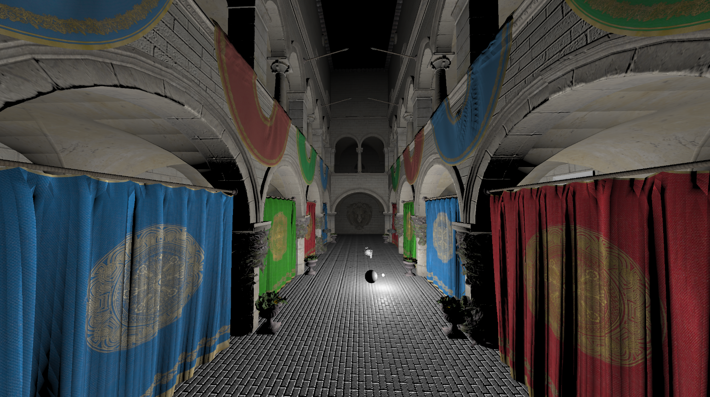
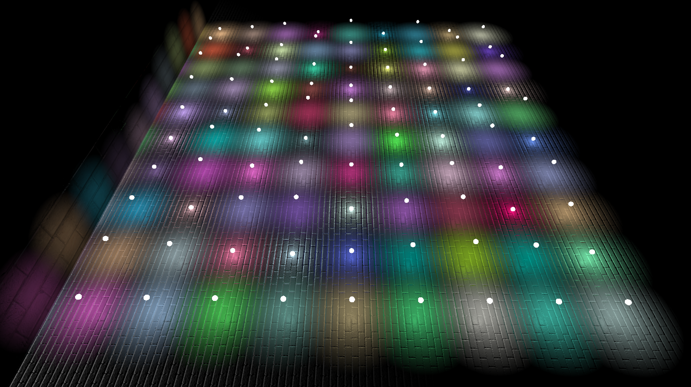
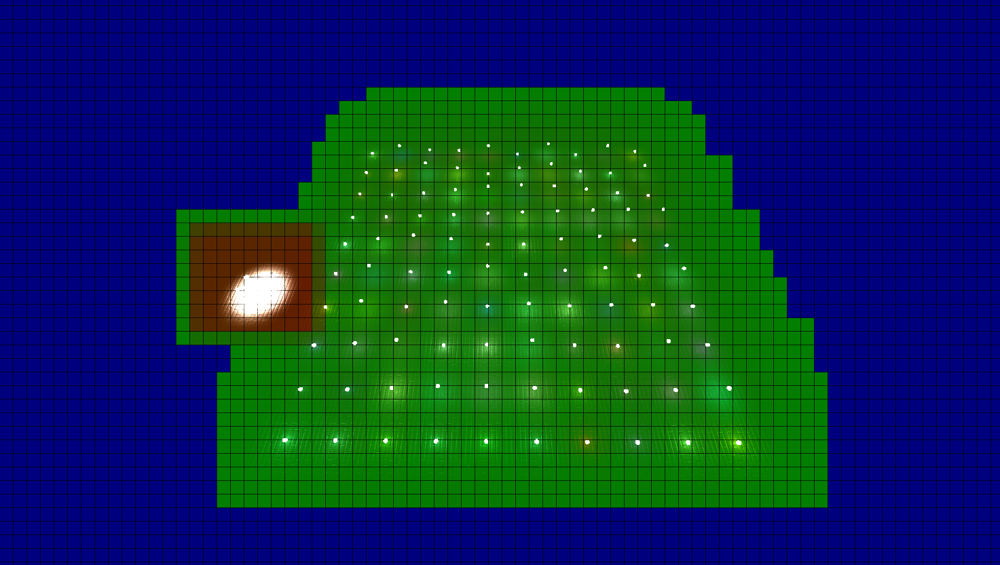
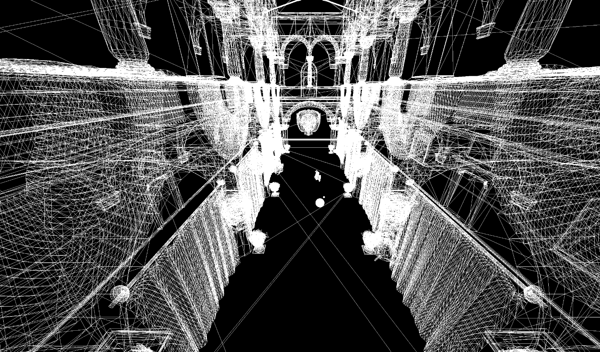
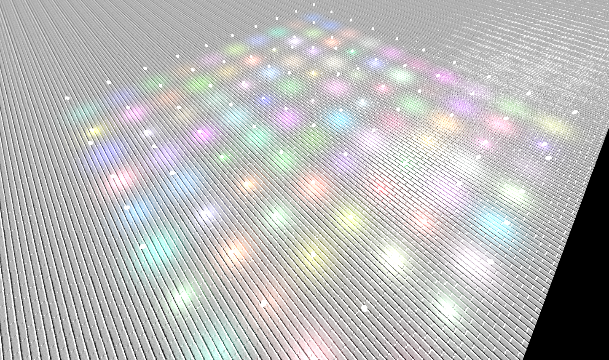

# Axion

Axion is a prototype engine written in C++. The purpose of this development is improving both graphics and C++ skills. The provided rendering engine is using OpenGL. Window mangement is using GLFW.

Key features :
- Modular design
- Package management
- GPU-based light culling

## Previews

*Sponza scene*

*Forward multiple light sources rendering*

*GPU light culling*

*Wireframe geometry rendering*

*Multiple light rendering*